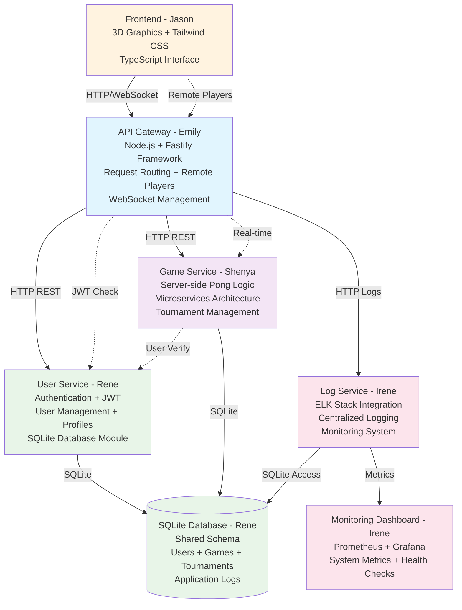
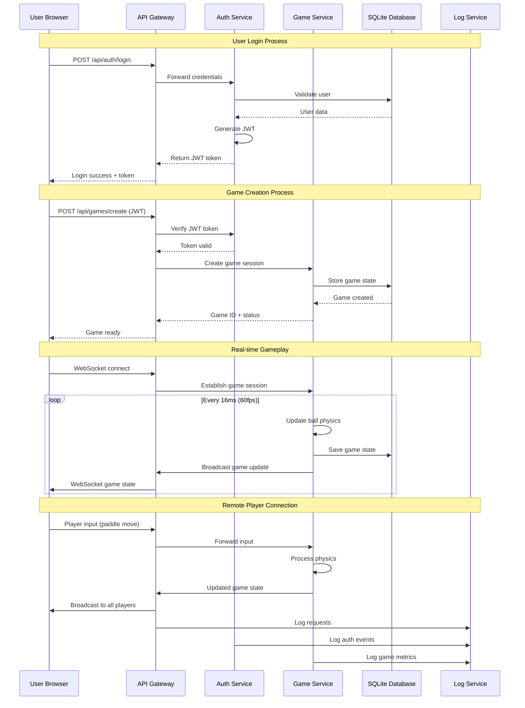

# Microservices Architecture Implementation

## Branch: `microservices-refactor`

## Overview
This branch implements the "Designing the Backend as Microservices" major module for ft_transcendence. We are restructuring the application from a monolithic architecture to a distributed microservices system.

## Diagram



## Time flow 




## Architecture Goals

### Service Boundaries
- **User Service**: Authentication, profiles, friends management
- **Game Service**: Pong logic, tournaments, matchmaking
- **Chat Service**: Real-time messaging system  
- **AI Service**: Computer opponent logic
- **API Gateway**: Request routing, authentication middleware

### Critical Design Decisions Needed

#### Database Strategy
- [ ] **Decision**: Shared database vs database per service
- [ ] **Rationale**: Document why we chose this approach
- [ ] **Implementation**: How services will access data

#### Inter-Service Communication
- [ ] **Synchronous**: HTTP REST APIs between services
- [ ] **Asynchronous**: Message queues/event system for real-time features
- [ ] **Real-time**: WebSocket handling across services

#### Authentication Flow
- [ ] **JWT Token Management**: Where tokens are validated
- [ ] **Service-to-Service Auth**: How services authenticate each other
- [ ] **User Session Handling**: Shared session state management

## Implementation Tasks

### Phase 1: Foundation (Week 1)
#### Infrastructure Setup
- [ ] Create Docker Compose configuration for all services
- [ ] Set up API Gateway with basic routing
- [ ] Configure service discovery mechanism
- [ ] Set up shared logging and monitoring

#### Service Scaffolding
- [ ] Create basic service containers (Node.js + Fastify)
- [ ] Implement health check endpoints for all services
- [ ] Set up inter-service communication protocols
- [ ] Create service-to-service authentication

### Phase 2: Core Services (Week 2)
#### API Gateway
- [ ] Request routing to appropriate services
- [ ] Authentication middleware
- [ ] Rate limiting and security headers
- [ ] Load balancing configuration

#### Service Integration Points
- [ ] Define API contracts between services
- [ ] Implement service discovery
- [ ] Set up distributed transaction handling
- [ ] Create error handling and circuit breaker patterns

### Phase 3: Advanced Features (Week 3+)
#### Scalability & Reliability
- [ ] Implement circuit breaker pattern
- [ ] Add service redundancy and failover
- [ ] Set up distributed logging (ELK stack integration)
- [ ] Performance monitoring and metrics

#### Integration Testing
- [ ] End-to-end testing across services
- [ ] Load testing for service communication
- [ ] Failure scenario testing (service outages)

## Technical Specifications

### Service Communication Patterns
```yaml
# HTTP REST for standard operations
User Service → Game Service: GET /users/{id}/profile

# WebSocket for real-time features  
Frontend ↔ API Gateway ↔ Game Service: WebSocket game state

# Message queues for async operations
Game Service → Chat Service: game_ended event
```

### Data Flow Examples
1. **User Authentication**: Frontend → Gateway → User Service → JWT response
2. **Game Creation**: Frontend → Gateway → Game Service → User Service validation
3. **Real-time Gaming**: Frontend ↔ Gateway ↔ Game Service (WebSocket)

## Directory Structure
```
/services/
  /api-gateway/
    /src/
    /Dockerfile
  /user-service/
    /src/
    /Dockerfile
  /game-service/
    /src/  
    /Dockerfile
  /chat-service/
    /src/
    /Dockerfile
/shared/
  /types/          # Shared TypeScript interfaces
  /utils/          # Common utilities
/docker-compose.yml
/docker-compose.dev.yml
```

## Dependencies & Integration Points

### Team Coordination Required
- **(Backend Framework)**: Must align Node.js/Fastify implementation with service architecture
- **(User Management + JWT)**: User service implementation and JWT handling across services
- **(Remote Players)**: WebSocket integration with service architecture  
- **(Server-side Pong)**: Game logic must work within Game Service boundaries

### External Module Dependencies
- User Management → All services need user context
- JWT Security → Gateway and all services need token validation
- Server-side Pong → Game Service core functionality
- Remote Players → Real-time communication across services

## Development Guidelines

### Code Standards
- TypeScript for all services
- Consistent API response formats
- Standardized error handling
- Service interface documentation

### Testing Strategy
- Unit tests for individual services
- Integration tests for service communication
- End-to-end tests for complete user flows
- Load testing for service scalability

## Deployment Configuration

### Development Environment
```bash
# Start all services
docker-compose -f docker-compose.dev.yml up

# Start specific service for debugging
docker-compose up api-gateway user-service
```

### Production Considerations
- Service health monitoring
- Load balancing configuration  
- Database connection pooling
- Logging aggregation

## Risk Assessment

### Technical Risks
- **Service Communication Failures**: Network partitions between services
- **Data Consistency**: Managing state across distributed services
- **Debugging Complexity**: Tracing issues across multiple services
- **Performance Overhead**: Network latency between services

### Mitigation Strategies
- Implement circuit breaker patterns
- Use distributed tracing (correlation IDs)
- Comprehensive logging and monitoring
- Service redundancy for critical components

## Success Criteria
- [ ] All services can start independently via Docker
- [ ] API Gateway successfully routes requests to appropriate services
- [ ] User authentication works across all services
- [ ] Real-time gaming functions through service architecture
- [ ] System handles individual service failures gracefully
- [ ] Performance is acceptable compared to monolithic approach

## Notes and Decisions Log
- **Date**: Decision made and rationale
- **Date**: Architecture changes and impact
- **Date**: Integration challenges and solutions