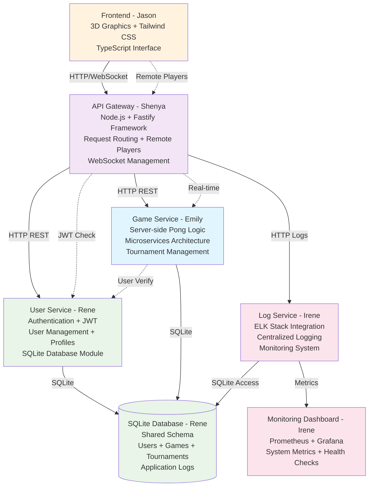
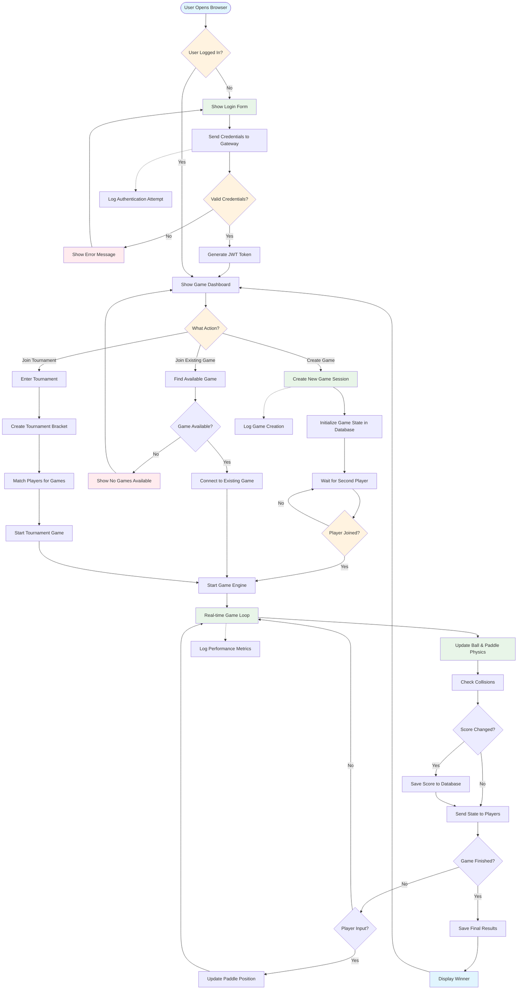

# ft_transcendence - Microservices Pong Platform

> **Current Status**: ✅ Core services implemented, ✅ ELK Stack integrated, ⚠️ Active development

## Quick Overview

**ft_transcendence** is a multiplayer Pong gaming platform built with microservices architecture. Currently includes:

- 🎮 **2D Frontend** (TypeScript + Tailwind CSS)
- 🚪 **API Gateway** with routing and WebSocket
- 👤 **User Service** (Auth + JWT + SQLite)
- 🏓 **Game Service** (Server-side Pong logic)
- 📊 **Log Service** (Complete ELK Stack)
- 🏆 **Tournament Service** (Competition management)

**Status**: Base Infrastructure ✅ | ELK Integration ✅ | Game Logic 🚧 | Frontend 🚧

# Microservices Architecture

## Diagram



## Time flow 


## Flow chart


## Starting the Project

### Basic Services Only (No Monitoring)
```bash
docker compose up -d
```

This starts:
- Gateway
- User Service
- Game Service  
- Tournament Service
- Frontend
- Log Service (but without ELK stack to send logs to)
- Database

### With Full Monitoring (Recommended for Development)
```bash
docker compose --profile monitoring up -d
```

This starts everything above PLUS:
- Elasticsearch
- Logstash
- Kibana
- Kibana Setup (auto-imports dashboards)

### Access Points

| Service | URL | Notes |
|---------|-----|-------|
| Frontend | http://localhost:3004 | Main application |
| Gateway | http://localhost:3000 | API Gateway |
| Kibana | http://localhost:5601 | Log visualization (monitoring profile only) |
| Logstash | http://localhost:5044 | Send logs here (port 5044→5000, monitoring profile only) |

**Note**: Logstash uses port 5044 externally because macOS reserves port 5000 for AirPlay Receiver.

## Stopping Services
```bash
# Stop all services but keep data
docker compose down

# Stop and remove all data (including logs!)
docker compose down -v

# Stop only monitoring services
docker compose --profile monitoring down
```

## Architecture Goals

### Service Boundaries
- **User Service**: Authentication, profiles, friends management
- **Game Service**: Pong logic, tournaments, matchmaking
- **Chat Service**: Real-time messaging system  
- **AI Service**: Computer opponent logic
- **API Gateway**: Request routing, authentication middleware

### Critical Design Decisions Needed

#### Database Strategy
- [x] **Decision**: Shared database vs database per service
- [ ] **Rationale**: Document why we chose this approach
- [x] **Implementation**: How services will access data

#### Inter-Service Communication
- [x] **Synchronous**: HTTP REST APIs between services
- [x] **Asynchronous**: Message queues/event system for real-time features
- [x] **Real-time**: WebSocket handling across services

#### Authentication Flow
- [ ] **JWT Token Management**: Where tokens are validated
- [ ] **Service-to-Service Auth**: How services authenticate each other
- [ ] **User Session Handling**: Shared session state management

## Implementation Tasks

### Phase 1: Foundation (Week 1)
#### Infrastructure Setup
- [x] Create Docker Compose configuration for all services
- [x] Set up API Gateway with basic routing
- [x] Configure service discovery mechanism
- [x] Set up shared logging and monitoring

#### Service Scaffolding
- [x] Create basic service containers (Node.js + Fastify)
- [x] Implement health check endpoints for all services
- [x] Set up inter-service communication protocols
- [x] Create service-to-service authentication

### Phase 2: Core Services (Week 2)
#### API Gateway
- [x] Request routing to appropriate services
- [x] Authentication middleware
- [ ] Rate limiting and security headers
- [ ] Load balancing configuration

#### Service Integration Points
- [ ] Define API contracts between services - halfway
- [x] Implement service discovery
- [ ] Set up distributed transaction handling
- [ ] Create error handling and circuit breaker patterns - halfway

### Phase 3: Advanced Features (Week 3+)
#### Scalability & Reliability
- [ ] Implement circuit breaker pattern
- [ ] Add service redundancy and failover
- [x] Set up distributed logging (ELK stack integration)
- [ ] Performance monitoring and metrics

#### Integration Testing
- [ ] End-to-end testing across services
- [ ] Load testing for service communication
- [ ] Failure scenario testing (service outages)

## Technical Specifications

### Service Communication Patterns
```yaml
# HTTP REST for standard operations
User Service → Game Service: GET /users/{id}/profile

# WebSocket for real-time features  
Frontend ↔ API Gateway ↔ Game Service: WebSocket game state

# Message queues for async operations
Game Service → Chat Service: game_ended event
```

### Data Flow Examples
1. **User Authentication**: Frontend → Gateway → User Service → JWT response
2. **Game Creation**: Frontend → Gateway → Game Service → User Service validation
3. **Real-time Gaming**: Frontend ↔ Gateway ↔ Game Service (WebSocket)

## Directory Structure
```
transcendence/
├── docker-compose.yml
├── docker-compose.dev.yml
├── README.md
├── docs/
│   ├── api-contracts.md
│   ├── architecture.md
│   └── deployment.md
├── services/
│   ├── gateway/              # API Gateway + Remote Players
│   │   ├── src/
│   │   ├── Dockerfile
│   │   └── package.json
│   ├── user-service/         # User Management + JWT
│   │   ├── src/
│   │   ├── Dockerfile
│   │   └── package.json
│   ├── game-service/         # Server-side Pong
│   │   ├── src/
│   │   ├── Dockerfile
│   │   └── package.json
│   └── log-service/          # Log Management + Monitoring
│       ├── src/
│       ├── Dockerfile
│       └── package.json
├── frontend/                 # 3D Graphics + Frontend Framework
│   ├── src/
│   ├── public/
│   ├── package.json
│   └── Dockerfile
├── shared/
│   ├── types/               # Shared TypeScript interfaces
│   ├── database/            # SQLite schema and migrations
│   ├── config/              # Environment variables and configs
│   └── utils/               # Common utilities
└── monitoring/              #  monitoring stack
    ├── elk/                 # ELK stack configuration
    ├── prometheus/          # Prometheus config
    └── grafana/             # Grafana dashboards
```

## Dependencies & Integration Points

### Team Coordination Required
- **(Backend Framework)**: Must align Node.js/Fastify implementation with service architecture
- **(User Management + JWT)**: User service implementation and JWT handling across services
- **(Remote Players)**: WebSocket integration with service architecture  
- **(Server-side Pong)**: Game logic must work within Game Service boundaries

### External Module Dependencies
- User Management → All services need user context
- JWT Security → Gateway and all services need token validation
- Server-side Pong → Game Service core functionality
- Remote Players → Real-time communication across services

## Development Guidelines

### Code Standards
- TypeScript for all services
- Consistent API response formats
- Standardized error handling
- Service interface documentation

### Testing Strategy
- Unit tests for individual services
- Integration tests for service communication
- End-to-end tests for complete user flows
- Load testing for service scalability

## Deployment Configuration

### Development Environment
```bash
# Start all services
docker-compose -f docker-compose.dev.yml up

# Start specific service for debugging
docker-compose up api-gateway user-service
```

### Production Considerations
- Service health monitoring
- Load balancing configuration  
- Database connection pooling
- Logging aggregation

## Risk Assessment

### Technical Risks
- **Service Communication Failures**: Network partitions between services
- **Data Consistency**: Managing state across distributed services
- **Debugging Complexity**: Tracing issues across multiple services
- **Performance Overhead**: Network latency between services

### Mitigation Strategies
- Implement circuit breaker patterns
- Use distributed tracing (correlation IDs)
- Comprehensive logging and monitoring
- Service redundancy for critical components

## Success Criteria
- [x] All services can start independently via Docker
- [x] API Gateway successfully routes requests to appropriate services
- [ ] User authentication works across all services
- [ ] Real-time gaming functions through service architecture
- [x] System handles individual service failures gracefully
- [x] Performance is acceptable compared to monolithic approach
