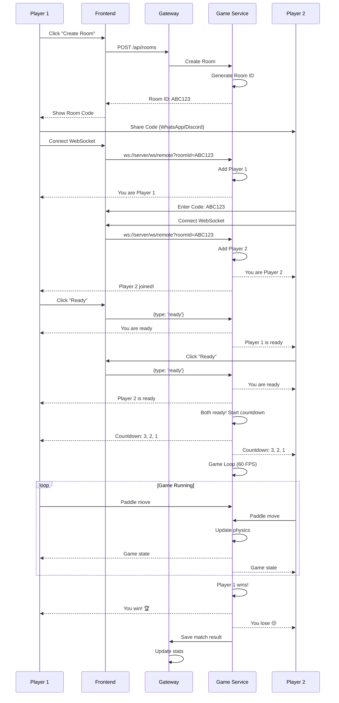

# Remote Player Module Documentation

## 📋 Overview

The Remote Player module allows users to play Pong in real-time against other users over the Internet. It implements a complete architecture for game rooms, user authentication, and WebSocket communication for synchronized gameplay.

---

## ✅ **Implemented Features**

### 🏗️ **Backend - Game Service**

#### **1. Room Management System**
- ✅ **RoomManager.js**: Centralized room management
  - Automatic room creation and deletion
  - Automatic matchmaking (quick match)
  - Cleanup system for inactive rooms
  - Player-to-room mapping

- ✅ **GameRoom.js**: Individual room logic
  - Support for 2 players per room
  - Game states (waiting, ready, playing, paused)
  - Countdown system before starting
  - Paddle movement and ball physics synchronization
  - Winner detection and game end

#### **2. Real-time WebSocket**
- ✅ **remoteWebSocket.js**: WebSocket connection handler
  - Endpoint: `/ws/remote?roomId=ABC123&playerId=user123&username=Player1`
  - Connection parameter validation
  - Message handling: `paddleMove`, `ready`, `ping`, `leave`
  - Game state broadcasting to all players
  - Disconnection and error handling

#### **3. REST API Endpoints**
- ✅ **POST /api/rooms**: Create new room
- ✅ **GET /api/rooms**: List all rooms
- ✅ **GET /api/rooms/:roomId**: Get specific room information
- ✅ **POST /api/matchmaking/join**: Quick match search
- ✅ **GET /api/stats**: Server statistics

### 🌐 **Gateway Integration**

#### **1. REST API Proxy**
- ✅ **game.route.ts**: REST endpoint proxy for game-service
  - All `/api/*` endpoints correctly redirected
  - Error handling and logging

#### **2. WebSocket Proxy**
- ✅ **ws-proxy.route.ts**: WebSocket proxy for remote connections
  - Endpoint: `/ws/remote` connecting to game-service
  - Bidirectional message forwarding
  - Connection and disconnection handling

### 🎨 **Frontend**

#### **1. Routing System**
- ✅? **router.ts**: `/remote` route added to SPA system
- ❌ **lobby.ts**: "Remote" button NOT in main navigation

#### **2. User Interface** (❌ **NOT IMPLEMENTED**)
- ❌ **pages/remote.ts**: Main remote player page DOES NOT EXIST
- ❌ UI for creating/joining rooms
- ❌ Game canvas with real-time rendering
- ❌ Keyboard controls (↑↓ for paddles)
- ❌ Room and player information display

---

## 🏗️ **System Architecture**

```
┌─────────────────┐    HTTP/WS     ┌─────────────────┐    HTTP/WS     ┌─────────────────┐
│                 │ ──────────────► │                 │ ──────────────► │                 │
│   Frontend      │                │     Gateway     │                │  Game Service   │
│  (Port 3004)    │ ◄────────────── │   (Port 3000)   │ ◄────────────── │   (Port 3002)   │
│                 │                │                 │                │                 │
└─────────────────┘                └─────────────────┘                └─────────────────┘
        │                                   │                                   │
        │                                   │                                   │
        ▼                                   ▼                                   ▼
┌─────────────────┐                ┌─────────────────┐                ┌─────────────────┐
│ • /remote route │                │ • REST proxy    │                │ • RoomManager   │
│ • WebSocket     │                │ • WS proxy      │                │ • GameRoom      │
│ • Canvas game   │                │ • Auth forward  │                │ • remoteWS      │
│ • User controls │                │ • Error handle  │                │ • Game logic    │
└─────────────────┘                └─────────────────┘                └─────────────────┘
```

---

## 🔥 **Game Features**

### **Room Creation and Management**
1. **Create Room**: Generates unique 6-character code (e.g., `ABC123`)
2. **Join by Code**: Enter code to join existing room
3. **Quick Match**: Automatic system that finds available room or creates new one
4. **Room States**: 
   - `waiting`: Waiting for players
   - `ready`: 2 players connected, waiting for ready
   - `playing`: Game in progress
   - `paused`: Game paused

### **Real-time Gameplay**
1. **Synchronization**: Game state synchronized every frame via WebSocket
2. **Controls**: ↑↓ keys to move paddles
3. **Physics**: Server-side ball physics simulation
4. **Scoring**: Real-time scoring system
5. **Win Condition**: First player to reach score limit wins

### **Connection System**
1. **WebSocket URL**: `ws://localhost:3000/ws/remote?roomId=ABC123&playerId=user123&username=Player1`
2. **Supported Messages**:
   - `init`: Connection initialization
   - `paddleMove`: Paddle movement (up/down/stop)
   - `ready`: Player ready to start
   - `gameStart`: Game start
   - `gameState`: Updated game state
   - `gameEnd`: Game end with winner

---

## ❌ **Non-Implemented Features**

### 🎨 **Critical Frontend**
- ❌ **Page `/remote`**: Main UI does not exist
- ❌ **Game Canvas**: Visual Pong rendering
- ❌ **User Controls**: Input handling for paddles
- ❌ **Connection States**: WebSocket connection indicators
- ❌ **Room Information**: Display of room code, players, etc.

### 🔐 **Authentication** (Partial Implementation)
- ❌ **Authentication Guards**: `/remote` page not protected
- ❌ **WebSocket Token**: Authentication not validated in connections
- ❌ **Real User Data**: Using generic names instead of user data

### 📊 **Advanced Features**
- ❌ **Match History**: Game results not saved
- ❌ **User Statistics**: No wins/losses tracking
- ❌ **Reconnection Logic**: No automatic reconnection handling
- ❌ **Spectator Mode**: No observer mode
- ❌ **Chat System**: No chat between players

---

## 🚀 **To Complete Implementation**

### **High Priority** 
1. **Create pages/remote.ts** - Main module UI
2. **Canvas Game Rendering** - Pong game visualization
3. **WebSocket Client Integration** - Frontend ↔ backend connection
4. **Keyboard Controls** - User input handling
5. **End-to-End Testing** - Verify complete functionality

### **Medium Priority**
1. **Complete Authentication** - Guards and token validation
2. **User Data Integration** - Use real user data
3. **Error Handling** - Robust connection error handling
4. **UI/UX Polish** - Improve user experience

### **Low Priority**
1. **Match History** - Persist game results in database
2. **Advanced Features** - Spectator mode, chat, reconnection
3. **Performance Optimization** - Optimize WebSocket and rendering

---

## 📁 **File Structure**

```
transcendence/
├── services/
│   ├── game-service/
│   │   ├── src/
│   │   │   ├── room/
│   │   │   │   ├── RoomManager.js     ✅ Implemented
│   │   │   │   └── GameRoom.js        ✅ Implemented
│   │   │   └── websocket/
│   │   │       └── remoteWebSocket.js ✅ Implemented
│   │   └── ...
│   └── gateway/
│       └── src/routes/
│           ├── game.route.ts          ✅ Implemented
│           └── ws-proxy.route.ts      ✅ Implemented
└── frontend/
    └── src/
        ├── app/
        │   └── router.ts              ✅ Route added ?
        └── pages/
            ├── lobby.ts               ❌ Button NOT added
            └── remote.ts              ❌ DOES NOT EXIST
```

---

## 🧪 **Testing**

### **Verified Endpoints** ✅
```bash
# Create room
curl -X POST "http://localhost:3000/api/rooms"
# Response: {"success":true,"roomId":"ABC123","joinUrl":"/game/remote?room=ABC123"}

# List rooms
curl "http://localhost:3000/api/rooms"
# Response: {"success":true,"rooms":[...]}

# Room info
curl "http://localhost:3000/api/rooms/ABC123"
# Response: {"success":true,"room":{...}}

# Quick match
curl -X POST "http://localhost:3000/api/matchmaking/join"
# Response: {"success":true,"roomId":"XYZ789"}
```

### **WebSocket Testing** ⚠️
- ✅ WebSocket connection functional
- ✅ Bidirectional messaging
- ❌ **Frontend UI for testing not implemented**

---

## 🎯 **Current Status: 70% Complete**

- ✅ **Backend**: Completely functional (100%)
- ✅ **Gateway**: Complete proxy (100%) 
- ❌ **Frontend**: Only routing, no UI (5%)
- ❌ **Authentication**: Not implemented (0%)
- ❌ **UI/UX**: Not implemented (0%)

### **For production use, missing:**
1. **Implement complete frontend** (`pages/remote.ts`) - CRITICAL
2. **Add Remote button in lobby** - CRITICAL
3. **Integrate user authentication**
4. **Exhaustive end-to-end testing**
5. **Polish UI/UX and error handling**

### **The remote player module has:**
✅ **Solid and complete backend foundation**
✅ **Functional gateway proxy**
❌ **Frontend completely absent**

---

## 📊 **Suggested Next Steps**

1. **Create `pages/remote.ts`** with:
   - UI for creating/joining rooms
   - Canvas for game rendering
   - Keyboard controls
   - WebSocket connection states

2. **Add Remote button in `lobby.ts`**

3. **Integrate authentication** in:
   - Route guards
   - WebSocket validation
   - User data instead of generic names

4. **End-to-end testing** of complete flow


### Sequence diagram (remote private)


### Flowchart
