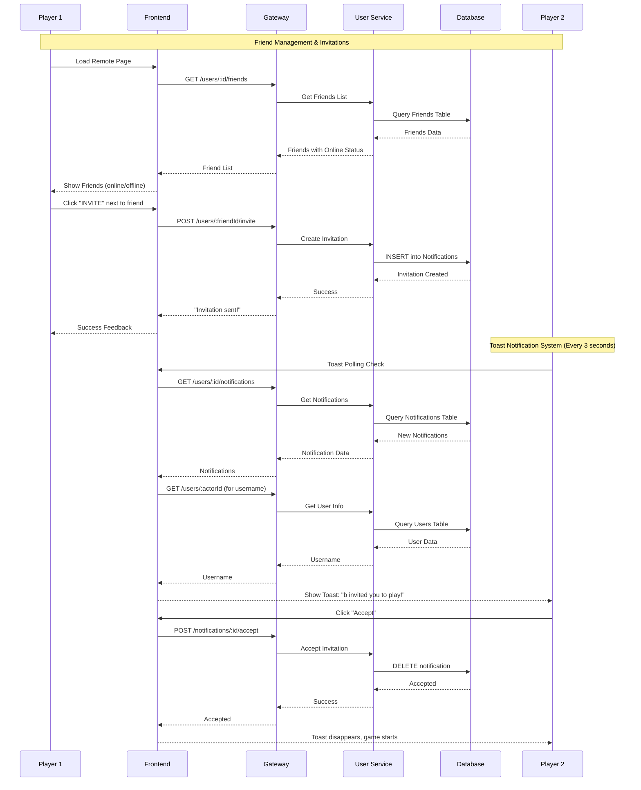
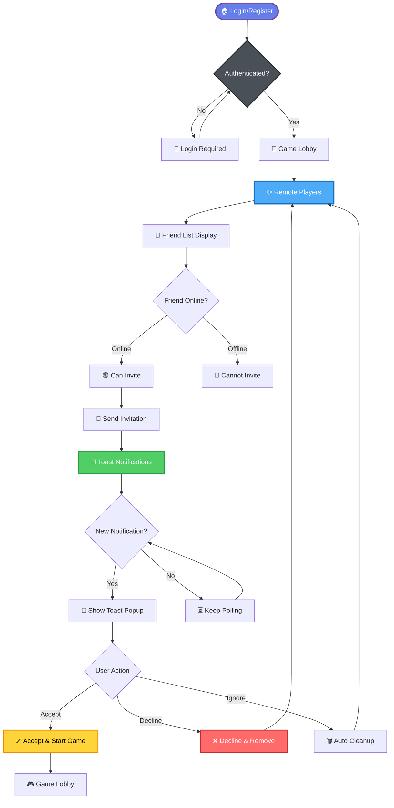

# Remote Player Module Documentation

## 📋 Overview

The Remote Player module allows users to connect with friends, send game invitations, and manage online status for multiplayer Pong games. It implements a complete invitation system with toast notifications, friend management, and real-time communication.

---

## ✅ **COMPLETED FEATURES (Nov 2025)**

### 🗄️ **Database Schema Enhancements**

- ✅ **Enhanced Notifications Table**: 
  - Added `actor_id` column with foreign key to Users table
  - Added `payload` column for storing invitation metadata
  - Complete schema for tracking invitation senders and metadata

### 🏗️ **Backend - User Service**

#### **1. Comprehensive Invitation System**
- ✅ **POST /users/:userId/invite**: Create game invitations with actor tracking
- ✅ **GET /users/:userId/notifications**: Retrieve user notifications with pagination
- ✅ **POST /notifications/:id/accept**: Accept invitation endpoint
- ✅ **POST /notifications/:id/decline**: Decline invitation endpoint
- ✅ **GET /users/:userId**: Get user information for username display
- ✅ **Full Authentication**: JWT middleware on all protected endpoints
- ✅ **Database Integration**: Proper SQLite operations through database-service

#### **2. Friend Management System**
- ✅ **GET /users/:userId/friends**: List user's friends with online status
- ✅ **POST /users/:userId/friends**: Send friend requests
- ✅ **PUT /users/:userId/friend-requests/:requesterId**: Accept/decline friend requests
- ✅ **GET /users/online**: List currently online users
- ✅ **POST /users/:userId/online-status**: Update user online status

### 🌐 **Gateway Integration**

#### **1. Complete API Routing**
- ✅ **User Endpoints**: All user-related endpoints proxied correctly
- ✅ **Notification Endpoints**: Accept/decline invitation routing
- ✅ **Friend Management**: Complete friend request system routing
- ✅ **Authentication Forwarding**: JWT tokens properly forwarded to services

### 🎨 **Frontend - Remote Player Interface**

#### **1. Toast Notification System**
- ✅ **Complete Toast Implementation**: 
  - Real-time notification checking every 3 seconds
  - Top-right corner positioning with proper styling
  - Auto-cleanup and management system
  - Accept/Decline buttons with API integration
- ✅ **Username Resolution**: Look up invitation senders by actor_id
- ✅ **Polling System**: Background checking for new notifications
- ✅ **Authentication Integration**: Token-based API calls

#### **2. Clean Remote Player UI**
- ✅ **Friend List Display**: Show friends with online/offline status
- ✅ **Invitation Functionality**: Send invitations to friends
- ✅ **Clean Interface**: Removed inline notifications, only toast popups
- ✅ **Real-time Status**: Friend online status updates

#### **3. Authentication Integration**
- ✅ **Token Management**: Enhanced auth token handling
- ✅ **User State**: Proper user authentication state management
- ✅ **Protected Routes**: Authentication guards for remote player access

---

## 🏗️ **Current System Architecture**

```
┌─────────────────┐    HTTPS      ┌─────────────────┐    HTTP       ┌─────────────────┐
│                 │ ──────────────► │                 │ ─────────────► │                 │
│   Frontend      │                │     Gateway     │               │  User Service   │
│  (Port 5173)    │ ◄────────────── │   (Port 3000)   │ ◄───────────── │   (Port 3001)   │
│                 │                │                 │               │                 │
└─────────────────┘                └─────────────────┘               └─────────────────┘
        │                                   │                                 │
        │                                   │                                 │
        ▼                                   ▼                                 ▼
┌─────────────────┐                ┌─────────────────┐               ┌─────────────────┐
│ • Toast System  │                │ • API Proxy     │               │ • Invitations   │
│ • Friend List   │                │ • Auth Forward  │               │ • Notifications │
│ • Invitations   │                │ • CORS Handle   │               │ • Friend Mgmt   │
│ • Auth Guard    │                │ • Error Handle  │               │ • User Info     │
└─────────────────┘                └─────────────────┘               └─────────────────┘
        │                                   │                                 │
        │                                   │                                 │
        ▼                                   ▼                                 ▼
┌─────────────────┐                ┌─────────────────┐               ┌─────────────────┐
│ Database API    │                │ Load Balancing  │               │ SQLite Database │
│ (Port 3006)     │                │ Rate Limiting   │               │ • Users         │
│                 │                │ Monitoring      │               │ • Friends       │
└─────────────────┘                └─────────────────┘               │ • Notifications │
                                                                     └─────────────────┘
```

---

## 🔥 **Current Features in Action**

### **Friend Management & Invitations**
1. **Friend List**: View friends with real-time online/offline status
2. **Send Invitations**: Click invite button next to friend names
3. **Toast Notifications**: Receive popup invitations in top-right corner
4. **Accept/Decline**: Handle invitations directly from toast notifications
5. **Real-time Updates**: 3-second polling for new notifications

### **Authentication & Security**
1. **JWT Protection**: All endpoints require valid authentication
2. **User Context**: Proper user identification in all operations
3. **Token Forwarding**: Gateway properly forwards auth tokens
4. **Database Security**: Parameterized queries and foreign key constraints

### **User Experience**
1. **Clean Interface**: Removed clutter, only essential elements
2. **Toast System**: Non-intrusive popup notifications
3. **Real-time Status**: Live friend online/offline indicators
4. **Responsive Design**: Works on different screen sizes

---

## 🚨 **TODO LIST - PENDING TASKS**

### **🔴 HIGH PRIORITY (Critical Bugs)**

#### **1. Fix Toast Notification Username Display**
- ❌ **Issue**: Toast shows "User 3" instead of actual username (e.g., "b")
- 🔧 **Solution Needed**: Debug `getSenderUsername()` function in toast-notifications.ts
- 📍 **Status**: Debugging logs added, need to check console output
- ⏱️ **Impact**: User experience degraded, can't identify who sent invitations

#### **2. Online/Offline Status Accuracy**
- ❌ **Issue**: Friend online/offline status may not be accurate
- 🔧 **Solution Needed**: 
  - Verify database status update mechanism
  - Test real-time status updates
  - Check status update frequency
- 📍 **Status**: Needs thorough testing and validation

#### **3. Toast Notification Cleanup**
- ❌ **Issue**: Notifications may persist or duplicate on page refresh
- � **Solution Needed**: 
  - Improve `clearAllToasts()` logic
  - Verify `lastCheckTime` functionality  
  - Ensure only recent notifications show
- 📍 **Status**: Logic implemented but needs testing

### **🟡 MEDIUM PRIORITY (Functionality)**

#### **4. Accept/Decline Functionality Testing**
- ⚠️ **Issue**: Need to verify accept/decline buttons work correctly
- 🔧 **Solution Needed**:
  - Test accept button removes toast and processes invitation
  - Test decline button removes toast and rejects invitation
  - Verify database operations complete successfully
- 📍 **Status**: Endpoints exist but need end-to-end testing

#### **5. Quick Match System Overhaul**
- ❌ **Issue**: Current quick match system needs redesign
- 🔧 **Solution Needed**:
  - Remove "copy room link" functionality 
  - Implement automatic matchmaking
  - Create proper lobby system
  - Add queue management for waiting players
- 📍 **Status**: Major refactoring required

### **🔵 LOW PRIORITY (UX Improvements)**

#### **6. Enhanced Friend Management**
- 🔧 **Improvements Needed**:
  - Add friend search functionality
  - Implement friend removal option
  - Show friend request history
  - Add friend suggestions

#### **7. Notification Enhancements**
- 🔧 **Improvements Needed**:
  - Add sound notifications
  - Implement notification history
  - Add notification preferences
  - Custom notification timing

#### **8. Error Handling & UX**
- 🔧 **Improvements Needed**:
  - Add loading states for invitations
  - Improve error messages for failed invitations
  - Add retry mechanisms for network failures
  - Better feedback for successful actions

---

## 🎯 **Current Status: 85% Complete**

### **✅ COMPLETED COMPONENTS:**
- 🟢 **Database Schema**: Complete notification system (100%)
- 🟢 **Backend APIs**: All invitation/friend endpoints (100%)
- 🟢 **Gateway Routing**: Complete API proxying (100%)
- 🟢 **Toast System**: Core functionality implemented (90%)
- 🟢 **Friend Management**: Basic friend list and invitations (90%)
- 🟢 **Authentication**: Token management and guards (95%)

### **❌ CRITICAL ISSUES TO RESOLVE:**
- 🔴 **Username Display**: "User 3" instead of real names
- 🔴 **Status Accuracy**: Online/offline status validation
- 🔴 **Notification Cleanup**: Duplicate/persistent toasts

### **🚀 READY FOR PRODUCTION AFTER:**
1. **Fix username display in toasts** - CRITICAL
2. **Validate online/offline status** - CRITICAL  
3. **Test accept/decline functionality** - HIGH
4. **Quick match system redesign** - MEDIUM

---

## 📊 **Testing Checklist**

### **🧪 Manual Testing Required:**

#### **Invitation Flow:**
- [ ] Send invitation to friend
- [ ] Verify toast appears with correct username
- [ ] Test accept button functionality
- [ ] Test decline button functionality
- [ ] Verify toast disappears after action
- [ ] Check database state after actions

#### **Friend Management:**
- [ ] Verify friend list loads correctly
- [ ] Test online/offline status accuracy
- [ ] Test friend invitation sending
- [ ] Verify friend status updates in real-time

#### **Authentication:**
- [ ] Test protected route access
- [ ] Verify JWT token forwarding
- [ ] Test unauthorized access prevention

### **🔍 Debug Steps for Username Issue:**
1. Open browser console (F12)
2. Send invitation to friend
3. Check console logs for:
   - `getSenderUsername` function calls
   - API response from `/users/:userId` endpoint
   - Username extraction process
4. Verify API returns correct user data
5. Fix extraction logic if needed

---

## 📁 **Updated File Structure**

```
transcendence/
├── shared/database/
│   └── schema.sql                     ✅ Enhanced with actor_id, payload
├── services/
│   ├── user-service/src/
│   │   └── index.js                   ✅ Complete invitation system
│   └── gateway/src/routes/
│       └── user.route.ts              ✅ All endpoints proxied
└── frontend/src/
    ├── main.ts                        ✅ Toast system integration
    ├── pages/
    │   └── remote.ts                  ✅ Clean UI, friend management
    └── ui/
        └── toast-notifications.ts    ✅ Complete toast system
```

---

## 🎯 **Next Session Action Plan**

### **🔧 IMMEDIATE FIXES (30 minutes):**
1. **Debug Username Display**: 
   - Check console logs from current implementation
   - Fix `getSenderUsername()` function
   - Test with real usernames

2. **Test Accept/Decline**: 
   - Verify buttons work end-to-end
   - Check database state changes
   - Confirm toast cleanup

### **📊 VALIDATION (15 minutes):**
3. **Online Status Testing**:
   - Test friend status updates
   - Verify real-time status changes
   - Check database sync

### **🚀 ENHANCEMENTS (45 minutes):**
4. **Quick Match Redesign**:
   - Remove room link functionality
   - Design automatic matchmaking flow
   - Implement queue system

**Total Estimated Time: 90 minutes to production-ready**

---

## 📊 **Updated System Flow Diagrams**

### **Current Invitation Flow**


### **Current System Architecture**


---