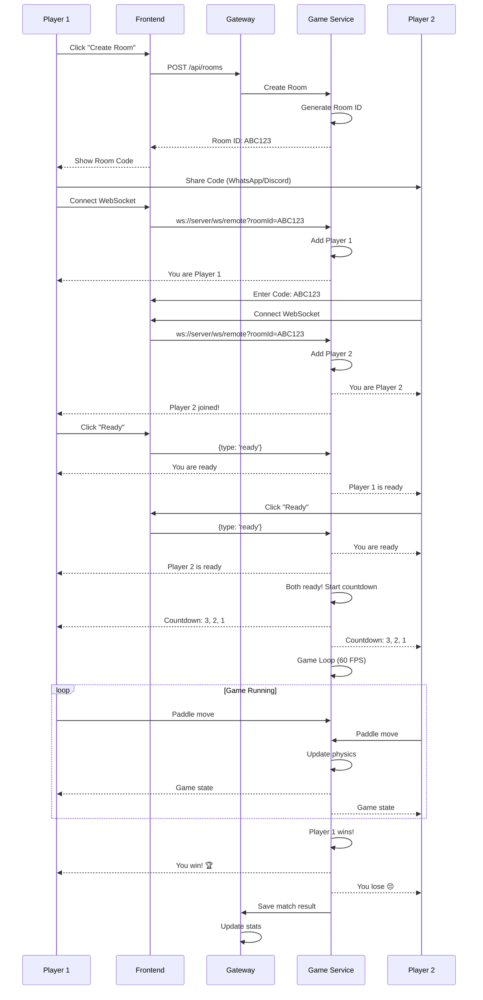
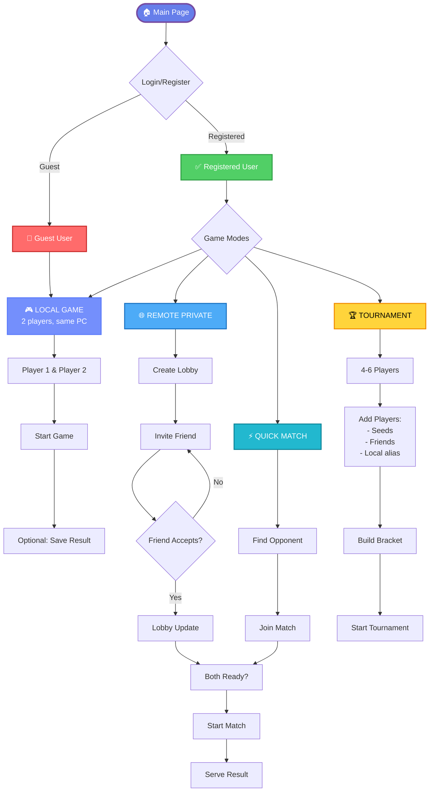

### Sequence diagram (remote private)

```mermaid
sequenceDiagram
    participant P1 as Player 1
    participant UI as Frontend
    participant GW as Gateway
    participant GS as Game Service
    participant P2 as Player 2
    
    P1->>UI: Click "Create Room"
    UI->>GW: POST /api/rooms
    GW->>GS: Create Room
    GS->>GS: Generate Room ID
    GS-->>UI: Room ID: ABC123
    UI-->>P1: Show Room Code
    
    P1->>P2: Share Code (WhatsApp/Discord)
    
    P1->>UI: Connect WebSocket
    UI->>GS: ws://server/ws/remote?roomId=ABC123
    GS->>GS: Add Player 1
    GS-->>P1: You are Player 1
    
    P2->>UI: Enter Code: ABC123
    P2->>UI: Connect WebSocket
    UI->>GS: ws://server/ws/remote?roomId=ABC123
    GS->>GS: Add Player 2
    GS-->>P2: You are Player 2
    GS-->>P1: Player 2 joined!
    
    P1->>UI: Click "Ready"
    UI->>GS: {type: 'ready'}
    GS-->>P1: You are ready
    GS-->>P2: Player 1 is ready
    
    P2->>UI: Click "Ready"
    UI->>GS: {type: 'ready'}
    GS-->>P2: You are ready
    GS-->>P1: Player 2 is ready
    
    GS->>GS: Both ready! Start countdown
    GS-->>P1: Countdown: 3, 2, 1
    GS-->>P2: Countdown: 3, 2, 1
    
    GS->>GS: Game Loop (60 FPS)
    
    loop Game Running
        P1->>GS: Paddle move
        P2->>GS: Paddle move
        GS->>GS: Update physics
        GS-->>P1: Game state
        GS-->>P2: Game state
    end
    
    GS->>GS: Player 1 wins!
    GS-->>P1: You win! 🏆
    GS-->>P2: You lose 😔
    GS->>GW: Save match result
    GW->>GW: Update stats
```

### Flowchart

```mermaid
flowchart TD
    Start([🏠 Main Page]) --> Login{Login/Register}
    
    Login -->|Guest| Guest[👤 Guest User]
    Login -->|Registered| Registered[✅ Registered User]
    
    Guest --> Local[🎮 LOCAL GAME<br/>2 players, same PC]
    
    Registered --> Modes{Game Modes}
    
    Modes --> Local
    Modes --> Remote[🌐 REMOTE PRIVATE]
    Modes --> Quick[⚡ QUICK MATCH]
    Modes --> Tourney[🏆 TOURNAMENT]
    
    %% LOCAL
    Local --> L1[Player 1 & Player 2]
    L1 --> L2[Start Game]
    L2 --> L3[Optional: Save Result]
    
    %% REMOTE PRIVATE
    Remote --> R1[Create Lobby]
    R1 --> R2[Invite Friend]
    R2 --> R3{Friend Accepts?}
    R3 -->|Yes| R4[Lobby Update]
    R3 -->|No| R2
    R4 --> R5[Both Ready?]
    R5 --> R6[Start Match]
    R6 --> R7[Serve Result]
    
    %% QUICK MATCH
    Quick --> Q1[Find Opponent]
    Q1 --> Q2[Join Match]
    Q2 --> R5
    
    %% TOURNAMENT
    Tourney --> T1[4-6 Players]
    T1 --> T2[Add Players:<br/>- Seeds<br/>- Friends<br/>- Local alias]
    T2 --> T3[Build Bracket]
    T3 --> T4[Start Tournament]
    
    style Start fill:#667eea,stroke:#764ba2,stroke-width:3px,color:#fff
    style Guest fill:#ff6b6b,stroke:#c92a2a,stroke-width:2px,color:#fff
    style Registered fill:#51cf66,stroke:#2f9e44,stroke-width:2px,color:#fff
    style Remote fill:#4dabf7,stroke:#1971c2,stroke-width:2px,color:#fff
    style Quick fill:#22b8cf,stroke:#0c8599,stroke-width:2px,color:#fff
    style Tourney fill:#ffd43b,stroke:#f08c00,stroke-width:2px,color:#000
    style Local fill:#748ffc,stroke:#5c7cfa,stroke-width:2px,color:#fff
```