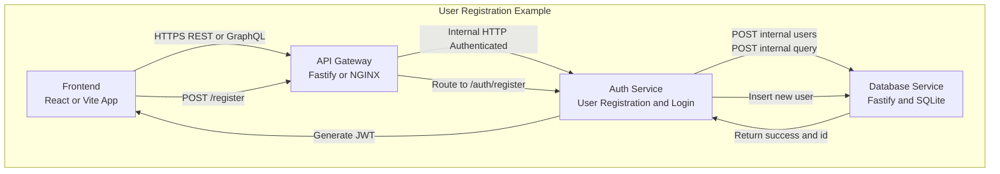

# 📝 Database Service (Fastify + SQLite)

A lightweight **internal database microservice** built with [Fastify](https://fastify.dev/), [better-sqlite3](https://github.com/WiseLibs/better-sqlite3), and [PQueue](https://github.com/sindresorhus/p-queue).  
It provides secure HTTP endpoints for **querying, reading, writing, and managing** an SQLite database.

---

## 🚀 Features

- 🧠 Auto-discovers database tables and columns on startup  
- 🛡️ Safe dynamic SQL generation with column/table validation  
- ⚙️ Serial write queue to prevent SQLite lock contention  
- 🔍 REST API for health checks, schema info, queries, and CRUD operations  
- 🧹 Graceful shutdown with WAL checkpointing  
- 🪶 Lightweight — no ORM, pure SQL and Fastify  

TODO
- 🔒 Optional internal token-based security (commented out)  

---

## 🧰 Tech Stack

- **Node.js** (v18+ recommended)
- **Fastify** for HTTP server
- **better-sqlite3** for database operations
- **PQueue** for sequential writes
- **CORS** enabled via `@fastify/cors`

---

## Overview

## 🏗️ Architecture Overview



## 🏠 Setup & Installation

### 1️⃣ Clone the repository
```bash
git clone <your-repo-url>
cd <your-repo-folder>


Install dependencies
npm install

3️⃣ Environment variables
Create a .env file (or export manually):
DATABASE_URL=sqlite:/app/shared/database/transcendence.db
DB_SERVICE_TOKEN=super_secret_internal_token
NODE_ENV=development
PORT=3006

If DATABASE_URL isn’t set, the service defaults to:
/app/shared/database/transcendence.db

4️⃣ Start the service
node database-service.js

You should see logs similar to:
📍 Connecting to SQLite database at: /app/shared/database/transcendence.db
✅ SQLite ready (WAL mode ON)
🔒 Database service running internally on port 3006
```


🧩 API Endpoints
All routes are internal (intended for use by other backend services).
🔹 Health Check

GET /health
Returns basic service and database info.

Response:
```json
{
  "status": "ok",
  "service": "database-service",
  "database": "sqlite",
  "wal_mode": "wal",
  "tables": ["users", "matches", "scores"],
  "timestamp": "2025-11-04T12:00:00.000Z"
}
```


🔹 Get Schema

GET /internal/schema
Lists all detected tables and columns.
Response:
```json
{
  "success": true,
  "tables": {
    "users": ["id", "username", "email"],
    "scores": ["id", "user_id", "points"]
  },
  "refreshedAt": "2025-11-04T12:00:00.000Z"
}
```

🔹 Query Data
POST /internal/query
Executes a SELECT with filters.
Body:
```json
{
  "table": "users",
  "columns": ["id", "username"],
  "filters": { "email": "test@example.com" },
  "limit": 10,
  "offset": 0
}
```

Response:
```json
{
  "success": true,
  "data": [
    { "id": 1, "username": "alice" }
  ]
}
```


🔹 Read Record
GET /internal/read?table=users&columns=id,username&id=1
Fetch a single record by ID.
Response:
```json
{
  "success": true,
  "data": { "id": 1, "username": "alice" }
}
```


🔹 Insert Record
POST /internal/users
Body:
```json
{
  "table": "users",
  "action": "insert",
  "values": { "username": "bob", "email": "bob@example.com" }
}
```

Response:
```json
{
  "success": true,
  "id": 42,
  "changes": 1
}
```


🔹 Update Record
POST /internal/write
Body:
```json
{
  "table": "users",
  "id": 42,
  "column": "email",
  "value": "new@example.com"
}
```

Response:
```json
{
  "success": true,
  "message": "Value written successfully",
  "changes": 1
}
```

🔹 List Records
GET /internal/list?table=users&columns=id,username&limit=10
Paginated list of rows from a table.
Response:
```json
{
  "success": true,
  "count": 2,
  "data": [
    { "id": 1, "username": "alice" },
    { "id": 2, "username": "bob" }
  ]
}
```


🧱 Internal Architecture
ComponentDescriptionbetter-sqlite3High-performance synchronous SQLite driverPQueueEnsures write operations execute sequentiallysafeIdentifier()Prevents SQL injection in table/column namesgetTablesAndColumns()Discovers schema on startup/internal/* routesRestricted for backend-only usefindFile()Utility to detect database file location


Do not expose this service to the public internet.

🧹 Graceful Shutdown
Handles SIGINT and SIGTERM:

Flushes WAL (wal_checkpoint(TRUNCATE))

Closes the SQLite connection cleanly

Exits process


📝 Development Notes


Logs are enabled by default (logger: true)

Schema refresh runs only once on startup (no polling)

You can extend this service to support joins, deletes, or more complex filters

⚠️ Security :TODO


The internal token check (x-service-auth) is currently commented out.
To enable it, uncomment the middleware:

```Javascript
fastify.addHook('onRequest', async (req, reply) => {
  const token = req.headers['x-service-auth'];
  if (token !== DB_SERVICE_TOKEN) {
    req.log.warn('🚫 Unauthorized access attempt to database service');
    return reply.code(403).send({ error: 'Forbidden: internal access only' });
  }
});
```

